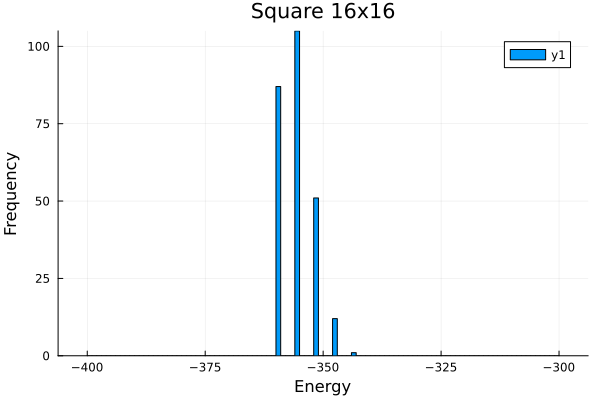

# MultiSpinCoding

<!-- [](https://ArrogantGao.github.io/MultiSpinCoding.jl/stable/) -->
<!-- [](https://ArrogantGao.github.io/MultiSpinCoding.jl/dev/) -->
[](https://github.com/ArrogantGao/MultiSpinCoding.jl/actions/workflows/CI.yml?query=branch%3Amain)
<!-- [](https://codecov.io/gh/ArrogantGao/MultiSpinCoding.jl) -->


An implementation of multi-spin coding for simulating the spin-glass model, according to "Optimised simulated annealing for Ising spin glasses".
The one implemented here is the method named `an_ms_r1_nf` in the paper, which requires $s = \pm 1$, $J_{ij} = \pm 1$ and $h = 0$.

## Usage

First install the package by typing the following in the Julia REPL:
```julia
] add https://github.com/ArrogantGao/MultiSpinCoding.jl
```

A simple example:
```julia
using MultiSpinCoding

# load the graph and the coupling matrix
g, J = load_instance("example/square16x16.txt")

# generate the model, n = 256 is the number of replicas
model = SpinGlass(g, J, 256)

# generate the scheduler, 2000 sweeps, beta0 = 0.1, beta1 = 3.0
scheduler = Scheduler(2000, 0.1, 3.0)

# run the simulated annealing
sa!(model, scheduler)

# calculate the energies
energies = cal_energies(model)
```

One can also use the script `example/square16x16.jl` to run the example, which will generate a histogram of the final energy of the replicas. The result is shown below:

